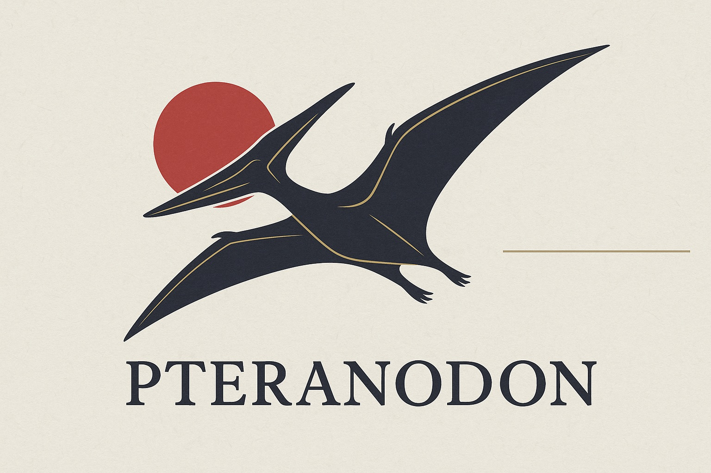

# 🦕 Docusaurus GitHub Pages Starter ～Pteranodon～

[](https://github.com/Sunwood-ai-labs/docusaurus-gh-pages-starter/actions/workflows/gh_actions_deploy.yml)
[](LICENSE)
[](https://docusaurus.io/)

> [!NOTE]
> 🚀 **プテラノドンが翼を広げて飛び立つように、あなたのドキュメントサイトも簡単にデプロイ！**

[Docusaurus v3](https://docusaurus.io/) と GitHub Pages を使用した、TypeScript 対応のドキュメントサイトテンプレートです。プテラノドンテーマで古代ロマンを感じながら、モダンな開発体験を提供します。

## ✨ 特徴

- 📝 **Docusaurus v3** - TypeScript完全対応の最新版
- 🦕 **Pteranodonテーマ** - 古代の翼竜をモチーフにしたオリジナルデザイン
- 🔄 **自動デプロイ** - GitHub Actions による CI/CD パイプライン
- ⚡ **TypeScript** - 型安全な開発環境
- 📱 **レスポンシブ対応** - モバイルファーストデザイン
- 🎨 **カスタマイズ可能** - 簡単にブランディング変更
- 🚀 **本格運用対応** - パフォーマンス最適化済み

## 🎯 ライブデモ

実際の動作確認: [https://sunwood-ai-labs.github.io/docusaurus-gh-pages-starter/](https://sunwood-ai-labs.github.io/docusaurus-gh-pages-starter/)

## 🚀 クイックスタート

### 1. このテンプレートを使用

1. 画面上部の **「Use this template」** ボタンをクリック
2. **「Create a new repository」** を選択
3. リポジトリ名と公開設定を選択
4. **「Create repository from template」** をクリック

### 2. 新しいリポジトリをクローン

```bash
git clone https://github.com/あなたのユーザー名/あなたのリポジトリ名.git
cd あなたのリポジトリ名
```

### 3. 依存関係をインストール

```bash
cd docs
npm install
# または
yarn install
```

### 4. 設定を更新

`docs/docusaurus.config.ts` を編集して、以下の値を更新してください：

```typescript
const config: Config = {
  title: 'あなたのサイト名',
  tagline: 'あなたの素晴らしいキャッチフレーズ',
  url: 'https://あなたのユーザー名.github.io',
  baseUrl: '/あなたのリポジトリ名/',
  organizationName: 'あなたのユーザー名',
  projectName: 'あなたのリポジトリ名',
  // ... その他の設定
};
```

### 5. GitHub Pages を有効化

1. リポジトリの **Settings** に移動
2. 左サイドバーの **Pages** をクリック
3. **Source** で **GitHub Actions** を選択

### 6. デプロイ

```bash
git add .
git commit -m "初期カスタマイズ"
git push origin main
```

🎉 **数分後に `https://あなたのユーザー名.github.io/あなたのリポジトリ名/` でサイトが公開されます！**

## 🛠️ 開発環境

### ローカル開発

```bash
cd docs
npm start
```

`http://localhost:3000` でローカルサーバーが起動します。ほとんどの変更はサーバーを再起動せずにリアルタイムで反映されます。

### ビルド

```bash
cd docs
npm run build
```

`docs/build` ディレクトリに静的ファイルが生成されます。

### ビルド済みサイトの確認

```bash
cd docs
npm run serve
```

ビルド済みのWebサイトをローカルで確認できます。

### 型チェック

```bash
cd docs
npm run typecheck
```

TypeScript の型チェックを実行します。

## 📁 プロジェクト構成

```
docusaurus-gh-pages-starter/
├── .github/
│   └── workflows/
│       └── gh_actions_deploy.yml    # GitHub Actions ワークフロー
└── docs/                           # Docusaurus プロジェクト
    ├── src/
    │   ├── components/              # Reactコンポーネント
    │   ├── css/                    # グローバルスタイル
    │   └── pages/                  # カスタムページ
    ├── static/
    │   ├── img/                    # 静的画像ファイル
    │   └── .nojekyll               # GitHub Pages 設定
    ├── blog/                       # ブログ記事（自動生成）
    ├── docs/                       # ドキュメント（自動生成）
    ├── docusaurus.config.ts        # メイン設定ファイル
    ├── sidebars.ts                 # サイドバー設定
    ├── package.json                # 依存関係
    └── tsconfig.json               # TypeScript 設定
```

## 🎨 カスタマイズ

### ブランディング

1. **サイトタイトル・キャッチフレーズ**: `docs/docusaurus.config.ts` で更新
2. **ロゴ**: `docs/static/img/Pteranodon.png` を置き換え
3. **ファビコン**: `docs/static/img/favicon-Pteranodon.ico` を置き換え
4. **カラーテーマ**: `docs/src/css/custom.css` のCSS変数を変更

### コンテンツ

- **ドキュメント**: `docs/docs/` フォルダにMarkdownファイルを追加
- **ブログ記事**: `docs/blog/` フォルダにMarkdownファイルを追加  
- **カスタムページ**: `docs/src/pages/` にReactコンポーネントを追加

### スタイリング

- **グローバルスタイル**: `docs/src/css/custom.css` を編集
- **コンポーネントスタイル**: CSS Modules または styled-components を使用
- **テーマ**: `docs/docusaurus.config.ts` の `themeConfig` で設定

## 🔧 設定オプション

### 基本設定

```typescript
// docs/docusaurus.config.ts
const config: Config = {
  // 基本サイト情報
  title: 'あなたのサイト名',
  tagline: 'あなたのキャッチフレーズ',
  favicon: 'img/favicon.ico',
  
  // デプロイ設定
  url: 'https://あなたのユーザー名.github.io',
  baseUrl: '/あなたのリポジトリ名/',
  organizationName: 'あなたのユーザー名',
  projectName: 'あなたのリポジトリ名',
  
  // コンテンツ設定
  onBrokenLinks: 'throw',
  onBrokenMarkdownLinks: 'warn',
};
```

### 高度なカスタマイズ

- **ナビゲーションバー**: 設定ファイルの `themeConfig.navbar` を変更
- **フッター**: 設定ファイルの `themeConfig.footer` を更新  
- **検索機能**: Algolia DocSearch の統合
- **アナリティクス**: Google Analytics やその他のサービスと連携
- **プラグイン**: コミュニティプラグインで機能拡張

## 📚 コンテンツの追加

### ドキュメント

`docs/docs/` に新しいファイルを作成：

```markdown
---
sidebar_position: 1
---

# 私のドキュメント

新しいドキュメントの内容です。
```

### ブログ記事

`docs/blog/` に新しいファイルを作成：

```markdown
---
slug: my-first-post
title: 私の最初の記事
authors: [あなたの名前]
tags: [docusaurus, blog]
---

初めてのブログ記事です！
```

## 🦕 Pteranodonテーマについて

このテンプレートは古代の翼竜「プテラノドン」をモチーフにしたオリジナルテーマを採用しています：

- **🦴 古代ロマン**: 先史時代のワクワクする冒険心
- **🪶 翼を広げる**: あなたのプロジェクトが大空に羽ばたく様子
- **🌋 原始の力強さ**: シンプルながら力強いデザイン
- **⚡ 進化**: 古代から現代への技術進歩を表現

## 🚀 デプロイメント

### 自動デプロイ

- `main` ブランチへのプッシュで自動的にデプロイを実行
- プルリクエストではビルドテストを実行
- サイトの更新は2-3分以内に反映

### 手動デプロイ

```bash
cd docs
npm run build
GIT_USER=あなたのユーザー名 npm run deploy
```

## 🔍 トラブルシューティング

### よくある問題

**TypeScriptエラーでビルドが失敗する場合:**
```bash
cd docs
npm run typecheck
# 報告された型エラーを修正してください
```

**サイトが正しく読み込まれない場合:**
- `docs/docusaurus.config.ts` の `baseUrl` を確認
- リポジトリ設定でGitHub Pagesが有効になっているか確認
- GitHub Actions ワークフローの権限を確認

**画像が表示されない場合:**
- 画像を `docs/static/img/` フォルダに配置
- Markdownでは `/img/your-image.png` として参照

### ヘルプを求める

- 📖 [Docusaurus ドキュメント](https://docusaurus.io/docs)
- 💬 [Docusaurus Discord](https://discordapp.com/invite/docusaurus)
- 🐛 [Issue報告](https://github.com/Sunwood-ai-labs/docusaurus-gh-pages-starter/issues)

## 🤝 コントリビューション

コントリビューションを歓迎します！お気軽にPull Requestを送ってください。

1. リポジトリをフォーク
2. フィーチャーブランチを作成 (`git checkout -b feature/AwesomeFeature`)
3. 変更をコミット (`git commit -m 'Add some AwesomeFeature'`)
4. ブランチにプッシュ (`git push origin feature/AwesomeFeature`)
5. Pull Request を作成

## 📄 ライセンス

このプロジェクトは MIT ライセンスの下で公開されています。詳細は [LICENSE](LICENSE) ファイルをご覧ください。

## 🙏 謝辞

- [Docusaurus](https://docusaurus.io/) - 素晴らしい静的サイトジェネレーター
- [GitHub Actions](https://github.com/features/actions) - シームレスなCI/CD
- [GitHub Pages](https://pages.github.com/) - 無料ホスティング

---

## 🌟 Star History

[](https://star-history.com/#Sunwood-ai-labs/docusaurus-gh-pages-starter&Date)

---

⭐ **このテンプレートが役に立った場合は、ぜひスターをお願いします！**

🦕 **プテラノドンと一緒に、あなたのドキュメントサイトを大空に羽ばたかせましょう！**

Made with ❤️ by [Sunwood AI Labs](https://github.com/Sunwood-ai-labs)
